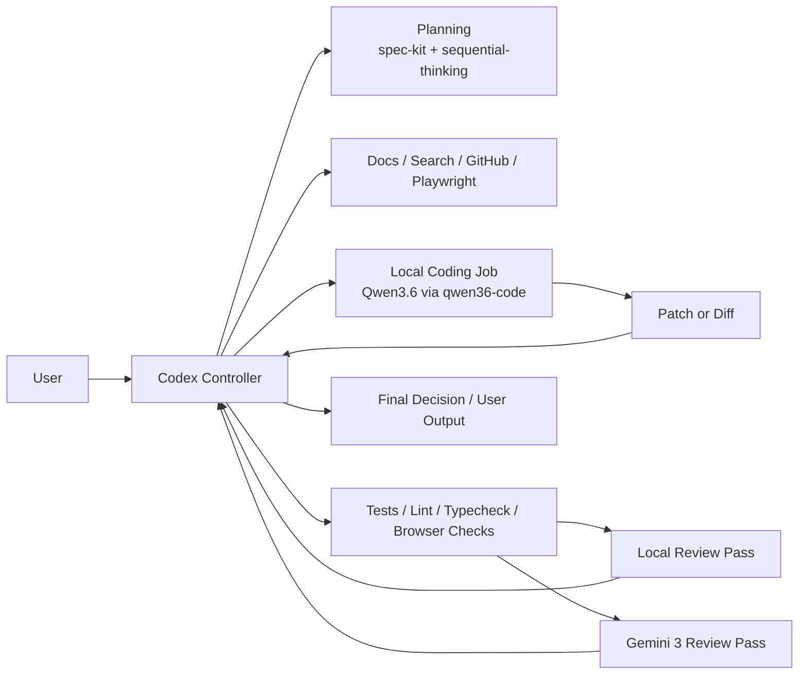

# Codex-Controlled Multi-Model Setup

Date: 2026-04-29

## Goal

Use `Codex` as the single controller for planning, context gathering, verification, and reconciliation.

Push high-token code generation to a local `Qwen3.6` worker.

Use a staged review loop:

- cheap local review first
- `Gemini 3` review second
- `Codex` decides which findings survive

## Reality Checks

- Keep one controller. Do not let multiple models compete to drive the same task.
- Use local models for bounded code generation and bounded review, not for repo-wide planning.
- Keep search, docs, GitHub, Playwright, and final acceptance in `Codex`.
- The machine-specific choice is now `Qwen3.6-35B-A3B-UD-IQ4_NL.gguf` served through `llama.cpp`.
- Do not turn Codex custom agents into Gemini/Qwen workers. In this repo, those agent templates are still OpenAI-model oriented. Use subordinate `codex exec` jobs or wrapper scripts instead.

## Recommended Stack

### Controller

- Main interactive `Codex` session on the normal hosted Codex/OpenAI model
- `spec-kit` + `sequential-thinking` for planning
- `Context7`, search, GitHub, and Playwright stay with the controller

### Local Coding Worker

Preferred:

- on-demand `llama.cpp`/`llama-server`
- `Qwen3.6-35B-A3B` `UD-IQ4_NL` GGUF
- `qwen36-code` as the bounded local coding worker

Why:

- leanest and most controllable path for this laptop-class setup
- keeps idle footprint at zero by starting/stopping the server on demand
- preserves Codex as the controller while reducing cloud token spend for drafts

Fallback:

- `Ollama` if you want the simplest setup and are willing to use an Ollama-published coding model such as `qwen3-coder`

### Review Workers

Cloud review:

- `Gemini 3 Pro`
- use the current Google model ID at implementation time; as of 2026-04-29, Google documents `gemini-3-pro-preview`

Local review:

- phase 1: reuse the local `Qwen3.6` worker for cheap first-pass review
- phase 2: if you still want a distinct local reviewer, add one smaller review-oriented model and keep it in the 20B-27B class

## Why llama.cpp Over LM Studio Or Ollama

`Ollama` is not the most efficient by default. It is the lowest-friction option.

For this plan, on-demand `llama.cpp` is the better default because:

- the user explicitly wants exact `Qwen3.6`
- the laptop target benefits from the leanest loaded runtime
- the local worker can start and stop around bounded coding jobs
- direct Codex model-provider wiring to `llama-server` is currently blocked by a tool schema mismatch

Use `Ollama` instead when:

- you want the fastest path to a working local coder
- you standardize on `qwen3-coder` or another Ollama-native coding model
- setup simplicity matters more than exact model family choice

Use `LM Studio` instead when:

- GUI model management matters more than minimal overhead
- you want manual experimentation with local model settings

## Target Architecture



## Operating Loop

### 1. Plan In Codex

- `Codex` creates the spec or plan
- `Codex` decides the exact file scope
- `Codex` defines acceptance checks before any local worker runs

### 2. Launch A Bounded Local Coding Job

Use the local Qwen worker for a bounded draft.

Examples:

```bash
qwen36-code -f src/file.ts 'Draft the smallest patch for this bounded change.'
```

For multiple calls where reload time matters:

```bash
QWEN36_KEEP_SERVER=1 qwen36-code -f src/file.ts 'Draft the smallest patch.'
```

Rules:

- send only the relevant files, task summary, and acceptance checks
- never dump the whole repo into the local worker unless the task truly needs it
- local worker returns a patch, diff, or tightly scoped file edits

### 3. Reconcile And Verify In Codex

- `Codex` reviews the local output
- `Codex` applies cleanup if needed
- `Codex` runs tests, lint, type checks, and browser checks
- failed verification returns to a new bounded local coding pass

### 4. Run Review In Two Stages

Stage 1:

- local review pass first
- cheap triage for obvious correctness, test, and regression issues

Example:

```bash
codex exec review --profile local-review --base main -
```

Stage 2:

- `Gemini 3` reviews only the candidate diff that passed local verification
- `Codex` reconciles local findings and Gemini findings into one answer

### 5. Final Decision Stays In Codex

- `Codex` decides whether to accept, revise, or discard external-model output
- `Codex` writes the final user-facing summary

## Most Efficient Process

Use this order:

1. `Codex` plans
2. local coder drafts code
3. `Codex` verifies
4. local reviewer screens cheaply
5. `Gemini 3` reviews only the reduced candidate diff
6. `Codex` reconciles and reports

This avoids paying cloud-review cost on code that already fails locally.

## Rollout Phases

### Phase 1: Codex + Local Coder

Implement only the local coding worker first.

Deliverables:

- `qwen36-code` and `qwen36-server`
- `qwen36-coder` Codex skill
- local Qwen coding rule in global Codex instructions
- `codex/scripts/install-qwen36-local.sh`

### Phase 2: Cheap Local Review Gate

Add a local review pass before any Gemini review.

Deliverables:

- review prompt template for local first-pass review
- diff-only review command
- acceptance threshold for when Gemini should run

### Phase 3: Gemini 3 Review Pass

Add the cloud review pass only after the local loop is stable.

Deliverables:

- Gemini review wrapper script or CLI integration
- reconciler prompt for Codex
- documented model ID and auth flow outside repo secrets

### Phase 4: Compare And Tune

Measure:

- local coding latency
- review latency
- test pass rate after first draft
- Gemini catch rate vs local review catch rate

Add promptfoo or repo-local eval tasks only after the workflow is stable.

## Future Implementation Targets

When you implement this plan, touch these files first:

- `codex/scripts/install-codex-mcp-setup.sh`
- `codex/README.md`
- `Local AI Coding Environment Setup.md`
- `codex/templates/skills/review/SKILL.md`

Likely new files:

- `codex/scripts/run-local-coder.sh`
- `codex/scripts/run-local-review.sh`
- `codex/scripts/run-gemini-review.sh`
- `codex/templates/skills/multimodel/SKILL.md`

Possible config shape to install later:

- `qwen36-code` local coding command
- local review command using the same Qwen worker
- Gemini review wrapper config via env vars, not committed secrets

## What Not To Do

- do not let the local coder own planning
- do not send web/docs/research tasks to the local model
- do not run Gemini on every intermediate draft
- do not keep multiple large local models loaded at once unless the machine can absorb it
- do not add a second local review model before proving the first local review gate is useful

## Decision Summary

Recommended default for this repo:

- `Codex` stays controller
- on-demand `llama.cpp`/`llama-server` is the default local provider for exact `Qwen3.6`
- `qwen36-code` is the supported Codex offload path
- `Ollama` remains the low-friction fallback if the local coding model shifts to `qwen3-coder`
- review becomes `local first-pass -> Gemini 3 second-pass -> Codex reconciler`

## References Checked

- OpenAI Codex local provider support was verified locally with `codex --help` and `codex exec --help`
- LM Studio Codex integration: https://lmstudio.ai/docs/integrations/codex
- Ollama Codex integration: https://docs.ollama.com/integrations/codex
- Ollama `qwen3-coder` model page: https://ollama.com/library/qwen3-coder
- Google Gemini model docs: https://ai.google.dev/gemini-api/docs/models/gemini
